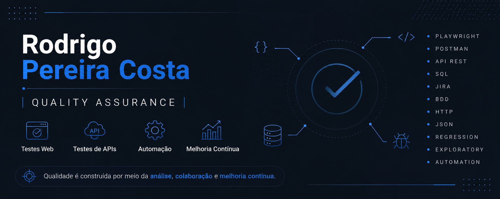
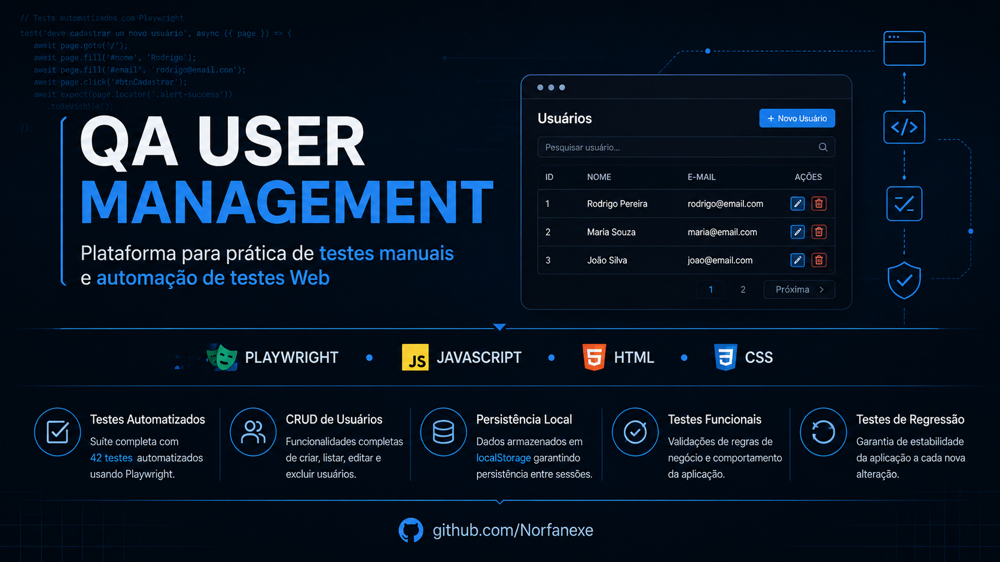
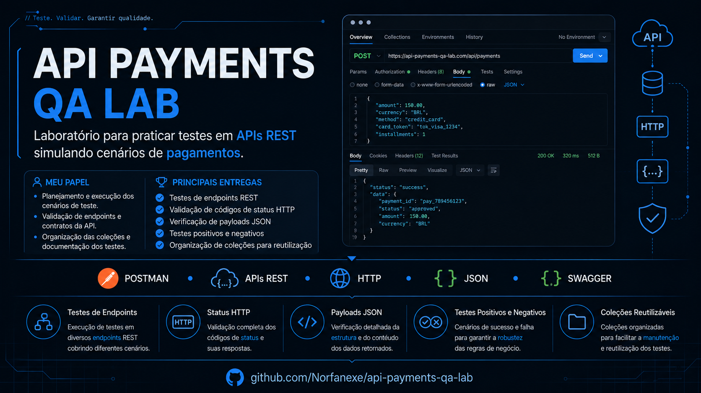
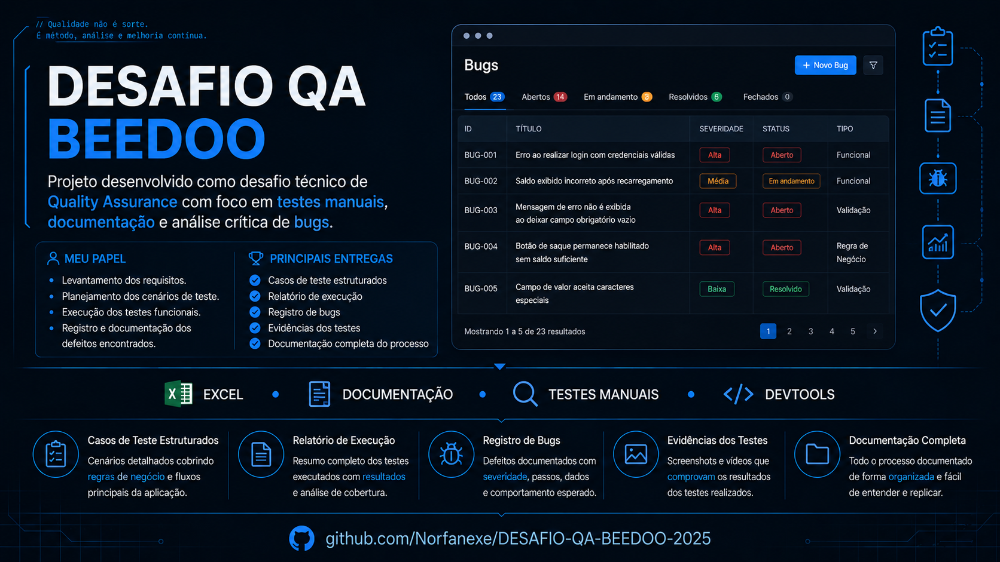
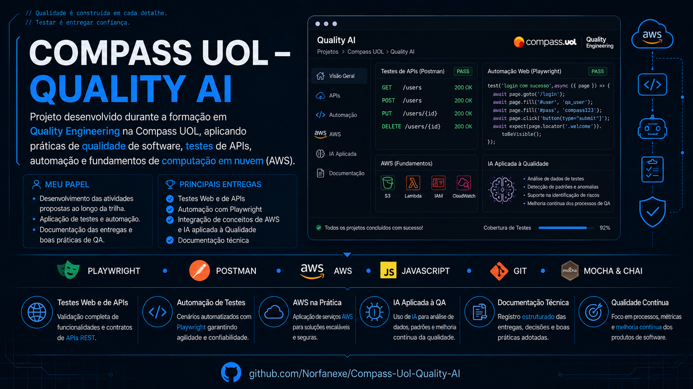

  

---

### GitHub Metrics 💻

### Qualidade de Software | QA

Profissional de Qualidade de Software com experiência prática em testes Web, testes de APIs e automação, contribuindo para a construção de soluções confiáveis por meio de boas práticas de qualidade e melhoria contínua.

Atualmente combino minha atuação em operações e análise de processos com estudos e projetos voltados para testes de software, buscando contribuir para o desenvolvimento de produtos mais seguros, confiáveis e alinhados às necessidades do negócio.

Minha visão é que a qualidade é construída por meio do entendimento das regras de negócio, da colaboração entre equipes e da melhoria contínua, e não apenas pela execução de testes.

---

## Especialidade

Minha trajetória profissional foi construída com base em organização, análise de processos, comunicação entre equipes e resolução de problemas. Essas experiências fortaleceram minha visão analítica e meu compromisso com a melhoria contínua, competências que hoje aplico na área de Qualidade de Software.

Ao longo da minha formação acadêmica e dos projetos desenvolvidos, adquiri experiência prática em testes Web, testes de APIs e automação, utilizando ferramentas como Playwright, Postman e Swagger, além de metodologias ágeis e boas práticas de qualidade.

Atualmente, busco evoluir continuamente como profissional de QA, contribuindo para o desenvolvimento de produtos confiáveis por meio de testes bem estruturados, entendimento das regras de negócio e colaboração com equipes multidisciplinares.

Acredito que bons testes começam com boas perguntas. Por isso, procuro compreender o contexto, as regras de negócio e os riscos envolvidos antes de definir uma estratégia de validação.

---

## Conhecimentos e Habilidades

| Área                      | Competências                                                                                                         |
| ------------------------- | -------------------------------------------------------------------------------------------------------------------- |
| **Qualidade de Software** | Planejamento e execução de testes Web, APIs, testes funcionais, exploratórios e regressivos                          |
| **Automação**             | Desenvolvimento e manutenção de testes automatizados com Playwright e JavaScript                                     |
| **APIs**                  | Validação de endpoints REST, contratos, requisições HTTP e respostas JSON utilizando Postman e Swagger               |
| **Ferramentas**           | Git, GitHub, Jira, Confluence e SQL                                                                                  |
| **Metodologias**          | Scrum, Kanban, BDD e Testes Baseados em Risco                                                                        |
| **Diferenciais**          | Investigação de problemas, análise de processos, documentação técnica, comunicação entre equipes e melhoria contínua |

---

## QA User Management

  

Aplicação desenvolvida para simular um sistema de gerenciamento de usuários, servindo como ambiente para prática de testes manuais e automatizados.

### 🎯 Meu papel

- Desenvolvimento da aplicação e da estratégia de testes.
- Planejamento e implementação da automação utilizando Playwright.
- Estruturação dos cenários de validação e regressão.

### ✅ Principais entregas

- 42 casos de teste automatizados
- Testes positivos e negativos
- Validação de regras de negócio
- Testes de regressão
- Relatório HTML de execução
- Estrutura preparada para expansão da suíte

### 💻 Tecnologias

`Playwright` • `JavaScript` • `HTML` • `CSS` • `LocalStorage`

---

## API Payments QA Lab

  

Laboratório desenvolvido para praticar testes em APIs REST simulando cenários de pagamentos, com foco na validação de regras de negócio, autenticação, respostas HTTP e consistência dos dados.

### 🎯 Meu papel

- Planejamento e execução dos cenários de teste.
- Validação de endpoints e contratos da API.
- Organização das coleções e documentação dos testes.

### ✅ Principais entregas

- Testes de endpoints REST
- Validação de códigos de status HTTP
- Verificação de payloads JSON
- Testes positivos e negativos
- Organização de coleções reutilizáveis

### 💻 Tecnologias

`Postman` • `REST APIs` • `HTTP` • `JSON` • `Swagger`

---

## Desafio QA Beedoo

  

Projeto desenvolvido como desafio técnico de Quality Assurance, contemplando testes manuais, documentação estruturada, análise crítica de bugs e raciocínio orientado à qualidade de software.

### 🎯 Meu papel

- Levantamento dos requisitos.
- Planejamento dos cenários de teste.
- Execução dos testes funcionais.
- Registro e documentação dos defeitos encontrados.

### ✅ Principais entregas

- Casos de teste estruturados
- Relatório de execução
- Registro de bugs
- Evidências dos testes
- Documentação completa do processo

### 💻 Tecnologias

`Excel` • `Documentação` • `Testes Manuais` • `DevTools`

---

## Compass UOL – Quality AI

  

Projeto desenvolvido durante a formação em Quality Engineering na Compass UOL, aplicando práticas de qualidade de software, testes de APIs, automação e fundamentos de computação em nuvem (AWS).

### 🎯 Meu papel

- Desenvolvimento das atividades propostas ao longo da trilha.
- Aplicação de testes e automação.
- Documentação das entregas e boas práticas de QA.

### ✅ Principais entregas

- Testes Web e de APIs
- Automação com Playwright
- Integração de AWS e IA aplicada à Qualidade
- Documentação técnica

### 💻 Tecnologias

`Playwright` • `Postman` • `AWS` • `JavaScript` • `Git` • `Mocha & Chai`

## Minha Filosofia de Qualidade

Acredito que qualidade vai além da identificação de defeitos. Ela começa na compreensão do problema, passa pela colaboração entre equipes e se fortalece com processos bem definidos, comunicação clara e melhoria contínua.

Para mim, testar é investigar, validar hipóteses e reduzir riscos, contribuindo para que cada entrega gere valor para o negócio e uma melhor experiência para o usuário.

Entendo que o papel do QA vai além da validação de funcionalidades. Um profissional de qualidade deve compreender o negócio, antecipar riscos, colaborar com diferentes equipes e contribuir para a evolução contínua do produto. É essa visão que procuro aplicar em cada projeto do qual participo.

> **"Bons testes começam com boas perguntas."**

## Certificações

### Qualidade de Software
- AWS & AI for Software Quality Engineering — Compass UOL
- Início Rápido em Teste e QA — Udemy

### Automação de Testes
- Automated Software Testing with Playwright — Udemy
- Automação de Testes de API com Postman + Projeto — Udemy

### Banco de Dados
- Banco de Dados 1: Fundamentos — Instituto Federal do Rio Grande do Sul (IFRS)

---

## Contato

Estou sempre aberto para trocar experiências sobre Qualidade de Software, colaborar em projetos e conhecer novas oportunidades profissionais.

- 💼 **LinkedIn:** https://www.linkedin.com/in/rodrigo-p-049465179/
- 📧 **E-mail:** Rodrigo68467@outlook.com
